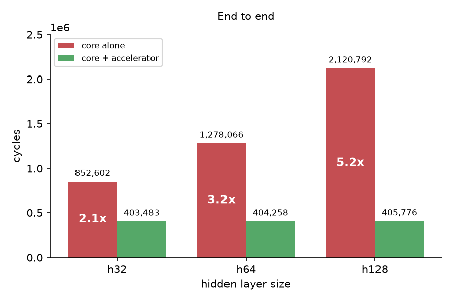
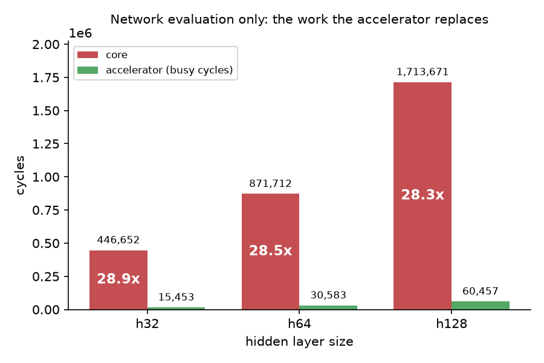

## 1. Overview

This is an RTL design project that creates from scratch a RISC-V RV32I CPU and a two layer LIF SNN (Leaky Integrate and Fire Spiking Neuron Network) accelerator built as a peripheral of the CPU core.

This project demonstrates:
1. A complete vertical stack of a SNN accelerator<br>
    a. RISC-V RV32I core that passed the RISC-V official rv32ui test<br>
    b. Trained 2 layer LIF SNN model with MNIST dataset (97.6% test accuracy) for image classification that produced the golden reference model for the inference accelerator.<br>
    c. Custom accelerator that processed testcases with 28x fewer cycles (60457 vs 1713671 cycles on core)<br>
    d. Thorough unit and datapath verification using C++, Assembly, and the golden reference model.
2. Statically structured system with cycle counts dependent only on the input data.<br>
    a. Every datapath is fixed, so no cycle has two possible next actions.

<br>

## 2. System Architecture

<br>

### Memory map

Instruction Space  (fetched by PC)

|Address| Size | Region | Access |
| ------|-------- | -------  | ------- |
|0x0000_0000 – 0x0000_0FFF|4 KB |imem|R|

Data Space  (load/store)

|Address| Size | Region | Access |
| ------|-------- | -------  | ------- |
|0x0000_0000 – 0x0000_0FFF| 4KB | dmem | R/W|
|0x1000_0000| 4B | PRINT | W |
|0x1000_0004| 4B| EXIT| W|
|0x1000_0008| 4B| PRINT_INT| W|
|0x2000_0000 – 0x2000_0FFF| 4KB | accel control| R/W|
|0x2000_1000 – 0x2000_1FFF| 4KB| event bank A|W|
|0x2000_2000 – 0x2000_2FFF| 4KB| event bank B|W|
|0x2002_0000 – 0x2003_FFFF| 128KB |w1| W|
|0x2004_0000 – 0x2004_0FFF| 4KB |w2| W|

<br>


### Host & Accelerator Interface

Registers
All within the accelerator control region, so addresses are `0x2000_0000 + offset`.

|Address| Name | Kind | Access | Bits | Meaning |
| ------|-------- | -------  | ------- |------- |------- |
|0x2000_0010 |T|config| W | 5 |timesteps per image, 1..31|
|0x2000_0014 |VTH1 |config | W | 16 | layer 1 threshold, signed|
|0x2000_0018 |VTH2 |config | W | 16 |layer 2 threshold, signed|
|0x2000_001C | K |config| W | 3 | parameter for leak shift, 1..5|
|0x2000_0020 | START |doorbell|W| — |  begin image pulse, doorbell data ignored|
|0x2000_0024 | EVA_LEN |config, per timestep|W | 10 | event count for bank A, 0..784; writing to it also marks bank full
|0x2000_0028 | EVB_LEN|config, per timestep| W | 10 | event count for bank B, 0..784; writing to it also marks bank full
|0x2000_002C | STATUS| status| R | 3 |3bits: {image_done, bank_b_free, bank_a_free}|
|0x2000_0030 |H_SHIFT| config | W | 3 |  ev_rd_data shift for generating w1 addr and layer-1 sweep counter limit|
|0x2000_0040 + 4w | COUNT[w]|result | R | 32 | four counts per word; each byte = `4w+lane`;w = 0..2

Shared Regions

|Region| Memory (expected) | Written By | Read By | Concurrent |
| ------|-------- | -------  | ------- |------- |
|ev bank A |LUTRAM| host, per timestep|drain| never (2 separate banks)|
|ev bank B |LUTRAM| host, per timestep| drain| never (2 separate banks)|
|w1|BRAM| preloaded before reset|drain|never (separate by stages) |
|w2|BRAM| preloaded before reset|drain|never (separate by stages) |

Host contract:
- write event length after writing an event bank to mark bank full.
- read COUNT before writing START for the next image.

<br>

### Sequence

```
boot:       T, VTH1, VTH2, K
            w1/w2 preloaded before reset

per image:
            fill bank A with t=0's spike events, write EVA_LEN
            START
            for t in 0..T-1:
                wait STATUS.bank_free for the opposite of current timestep read bank
                fill it with timestep t+1's spike events
                write that bank's LEN
            wait STATUS.image_done
            read COUNT[0..2], unpack 10 counts, argmax on the host
```
<br>

## 3. Decisions & Rejected Alternatives

<br>

### 3.1 Tooling and environment

| # | Decision | Chose | Rejected | Because |
|---|---|---|---|---|
| D1 | FPGA board | Arty A7-100T | Basys3, PYNQ Z2, DE1-SoC, DE2-115 | No prewritten SoC, most balanced and accessible |
| D2 | Waveform viewer | GTKWave | Surfer, NovyWave | Mature ecosystem |
| D4 | HDL | Verilog-2001 | SystemVerilog | Harder to learn, more fundamental |
| D5 | Verification methodology | Directed C++ benches + riscv-tests + golden model | UVM / constrained-random | Covers what's needed without expensive license |

<details>
<summary>D1: What FPGA board to run on</summary>

**Chose:** Arty A7 100T

**Rejected:** Basys3, PYNQ Z2, DE1-SoC, DE2-115

**Because:**

||Arty A7 100T|Basys3 |DE2-115| DE1-SoC| PYNQ Z2|
| ------|-------- | -------  | ------- | ------- |---|
|LC/LE|101k|33k|114k|85k|85k|
|BRAM|4.8Mb|1.8Mb|3.8Mb|3.9Mb|4.9Mb|
|Tool|Vivado|Vivado|Quartus Prime|Quartus Prime|Vivado|
|Reason|Most balanced, accessible (in Taiwan), and within budget.| Same series as A7 100T but three times smaller. BRAM too small for the project.|Massive physical I/Os that aren't needed in this project. Harder to source than the Arty A7 100T.|Built in system on chip (SoC), used in my ECE241 course next term, displacing the RISC-V core which is a point of the project. |Built in SoC and Jupyter/Python environment. However, this project will not be running Python on the chip and will only execute C programs (Pytorch is traintime only).

<small>LC/LE units depends on the vendor and are not directly comparable; written for order-of-magnitude comparison only</small>

**Revisit if:**

Reconsider PYNQ Z2 if accelerators, embedded vision, or AI inference became the project core.
Consider DE1-SoC for September target, to demonstrate vendor portability.

</details>

<details>
<summary>D2: What waveform viewer to use</summary>

**Chose:** GTKWave

**Rejected:** Surfer, NovyWave (other open source tools).

**Because:** GTKWave is the oldest, most documented waveform viewer, and it integrates friction-free with Verilator's trace formats. Most Verilator tutorials or discussions on online forums assume the use of GTKWave. Surfer has newer UI but less ecosystem maturity that is more important.


<small>Commercial tools like Synopsys Verdi are not considered due to the cost of license.</small>

**Revisit if:** Another waveform viewer provides significantly better performance or Verilator integration.

</details>

<details>
<summary>D4: What HDL to write in</summary>

**Chose:** Verilog-2001

**Rejected:** SystemVerilog (SV)

**Because:** The smallest common language every tool in the flow fully supports. SV is a superset of Verilog, so learning it afterward is incremental and easier than the reverse, as Verilog includes syntaxes that SV simplifies (combinational completeness, latch inference).

**Revisit if:** Future projects will likely use SV, this codebase stays Verilog-2001.

</details>

<details>
<summary>D5: What verification methodology to use</summary>

**Chose:** Directed C++ testbenches per RTL block, the official riscv-tests suite as an external referee for the core, golden reference model as the correct answer of the accelerator.

**Rejected:** UVM / constrained-random verification

**Because:** UVM pays off at team scale with verification IP, component isolation, and constrained-random coverage. However, it needs commercial simulators Verilator can't replace, and the functions it provides are not essential to a single cycle core.

**Revisit if:** A team-scale project with commercial seats, or a pipelined core, where hazard × forwarding × flush combinations create the state space of constrained-random.

</details>

<br>

### 3.2 Host core

| # | Decision | Chose | Rejected | Because |
|---|---|---|---|---|
| D3 | How to get a CPU host | Write RV32I from scratch | PicoRV32 / FemtoRV | Part of the goal, and good RTL practice for accelerator |
| D6 | Single-cycle or pipelined | Single-cycle | 5-stage pipeline | Current measuring metric |
| D7 | Base ISA or extensions | RV32I only | RV32IM, RV32IMC, custom ISA | Smallest core without multipliers |
| D8 | Where branch comparison lives | Dedicated comparator (branch.v) | Route through the ALU | Costs little hardware and doesn't need translation logic |

<details>
<summary>D3: How to obtain a CPU host</summary>

**Chose:** Write RV32I core from scratch.

**Rejected:** PicoRV32/FemtoRV as host.

**Because:** The project is the whole stack, and dropping in someone else's core leaves half of it unbuilt. Writing the CPU first also meant learning the RTL patterns the accelerator needed later, on a design with a published spec to check against.

**Revisit if:** Core verification wasn't complete by late July, then swap in PicoRV32 and the accelerator will be the entire project. Since core verification was completed, there will be no revisits.

</details>

<details>
<summary>D6: Single-cycle or pipelined host</summary>

**Chose:** Single-cycle.

**Rejected:** 5-stage pipeline.

**Because:** The metric used in this project is cycle count, and pipelining only raises clock speed. Pipelining also introduces the need to test instruction interactions with stalls and flushes, which doesn't align with the current verification approach of testing each instruction by itself.

**Revisit if:** The metric changes from cycle count to the actual time speed on the FPGA.

</details>

<details>
<summary>D7: Base ISA or extensions</summary>

**Chose:** RV32I only (-march=rv32i -mabi=ilp32).

**Rejected:** RV32IM, RV32IMC, custom ISA.

**Because:**

||RV32I|RV32IM|RV32IMC|Custom ISA|
|---|---|---|---|---|
|Multiply|Software (gcc libgcc)|Hardware|Hardware|Custom, undefined|
|Instruction width|Fixed 32-bit|Fixed 32-bit|Mixed 16/32-bit|Undefined|
|Toolchain|riscv64-unknown-elf-gcc, multilib (-march=rv32i)|Same toolchain (-march=rv32im)|Same toolchain (-march=rv32imc)|None, I'd write my own|
|riscv-tests compliance|Yes|Yes|Yes|No, no spec to conform to|
|Reason|Mostly loads/stores/branches, not math. Smallest ISA that still runs real C.|Multiply is rare here. A hardware multiplier would sit unused.|Two instruction sizes add decode complexity for no real benefit.|No real compiler or compliance suite to prove it runs C.|

**Revisit if:** Multiply turns out to be a bottleneck in the future, then M would be added first.

</details>

<details>
<summary>D8: Where branch comparison lives</summary>

**Chose:** Dedicated comparator module (branch.v) beside the ALU; ALU idle during branches.

**Rejected:** Routing comparison through the ALU (textbook structure).

**Because:** The ALU was already verified at ten operations; routing branches through it reopens a verified block. The branch funct3 codes also don't map directly to the ALU's, so sharing also needs translation logic (the textbook wires branches to the ALU because it only implements BEQ, which needs just a subtract-and-check-zero). A dedicated comparator costs a small number of LUTs out of 63k of the Arty.

**Revisit if:** The core is pipelined.

</details>

<br>

### 3.3 Accelerator

The accelerator runs on a fixed dataflow, every cycle has one possible next action, and the only unpredictability is the number of spikes each image produces. Therefore dynamic arbitration was considered but not needed.

As the dataflow is fixed, there is no schedule to produce. `tools/snnc` only checks the network against the hardware limits and compiles a driver config. 

| # | Decision | Chose | Rejected | Because |
|---|---|---|---|---|
| A1 | Input encoding | Rate coding | Latency (temporal) coding | Better model robustness and training effectiveness |
| A2 | Reset policy | Soft reset (subtract) | Hard reset (zero) | SNN default. Supports rate coding by preserving old magnitudes |
| A3 | Membrane leak in hardware | `V -= V>>k` shift-subtract | Fixed-point multiply by beta | No correct answer and doesn't need a hardware multiplier |
| A4 | Number formats and accumulator width | int8 w, int16 v, int32 acc | int16 acc, int32 v | acc does not overflow int32, v is clamped, and weights fit the lanes |
| A5 | Reset timing | Immediate | Deferred one timestep | No additional signal to carry over timesteps |
| A6 | Weight quantization | QAT | PTQ | Trains what the hardware runs on |
| A7 | Random number source for rate coding | Stateless Wang hash | Stateful PRNG | No constant reimplementation |
| A8 | Where the spike encoder runs | On the core, over MMIO | In the accelerator, or a laptop over UART | Part of data preprocessing |
| A9 | How the spike queue reaches the accelerator | Event index list + length | 784-bit bitmap | Produced alongside the encoder |

<details>
<summary>A1: What type of input encoding to use</summary>

**Chose:** Rate coding

**Rejected:** Latency (temporal) coding

**Because:** Rate encoding is better for model robustness and training effectiveness. Latency encoding relies on brighter pixels spiking earlier, which means each spike carries more information and there are fewer spikes in total for the image. That makes the model noisier and harder to train, with the tradeoff of better energy efficiency. This is especially important to my model because it uses quantized training (QAT) for the accelerator's integer weight input: the less redundancy of spikes, the more quantization costs.

**Revisit if:** Input becomes dependent on spike timing. A static MNIST image is not.

</details>

<details>
<summary>A2: What is the reset policy</summary>

**Chose:** membrane potential subtract threshold (soft reset)

**Rejected:** membrane potential reset to zero (hard reset)

**Because:** The default snn.Leaky reset mechanism is subtract (snntorch's documentation notes that subtract performs better on a few benchmarks). Subtract preserves the previous timestep's magnitude, which is important for rate coding because rate coding depends on the spikes of every timestep, not just the first one (like latency coding). Choosing subtract over zero does not cost anything on the hardware side.

**Revisit if:** Membrane potential (v) is driven into saturation (the int16 width limit) often enough to distort the results.

</details>

<details>
<summary>A3: How to leak membrane potential in hardware</summary>

**Chose:** multiplicative leak `V *= β` implemented as one arithmetic shift-subtract,
`V -= V>>k`, which equals `V*(1 - 2^-k)`. So `β = 1 - 2^-k`.
(k=1→0.5, k=2→0.75, k=3→0.875, k=4→0.9375, k=5→0.96875)

**Rejected:** a general fixed-point multiply by an arbitrary β

**Because:** β is a hyperparameter with no correct answer, so there is no approximation error, and a shift can be implemented in the accelerator faster and with less hardware. An arbitrary β allows more options but costs a multiplier in the accelerator.

**Revisit if:** none of k=1..5 trains acceptably. All five did, so k=2 was chosen and will not be revisited.

</details>

<details>
<summary>A4: What number formats and accumulator width to use</summary>

**Chose:** weights `int8`, membrane v `int16`, accumulate arriving weights (acc) in an
`int32` register, then saturate (clamp) to int16 on writeback to v.

**Rejected:** accumulate arriving weights (acc) in an `int16` register and storing membrane v in `int32` register.

**Because:** for int8 weights, the measured values of v and acc stay well inside int16 (across all three models max|acc| = 2,402, max|v| = 8,874, see docs/img for value distribution). Acc is int32 because it has to cover the worst case: 784*127 = 99568 in the hidden layer, which exceeds int16's 32767. At that width it cannot overflow, so it needs no clamp. V is int16 because the leak and the threshold subtraction bound it, and the clamp on writeback catches anything past that. The saturation clamps v>32767 to 32767 and v<-32768 to -32768 so that it doesn't wrap to the wrong signed values.

Weights are int8 because LANES*8 fits one word perfectly, so the drain reads one word per lane group, and the accuracy measurements show that a bigger width would not benefit much.

**Revisit if:** a re-measurement shows frequent clamping that rescaling weights can't fix, then widen v to `int32`. Experiment showed that clamping never triggered. Also worth revisiting with an int32 v once there is a Vivado setup, where the synthesis will reveal which one uses less hardware (int16 + clamp or int32 without clamp).

</details>

<details>
<summary>A5: Immediate or deferred reset timing</summary>

**Chose:** Immediate reset. On fire, subtract `V_th` on the same timestep the neuron
crosses threshold

**Rejected:** Deferred reset where the subtraction lands on the next timestep

**Because:** For deferred reset, it needs additional hardware to carry the pending reset bit per neuron to the next timestep, and the accuracy for deferred reset isn't better than immediate reset.

**Revisit if:** deferred reset trains materially better. Measured at h128 with the integer model: 97.02% deferred vs 97.63% immediate (float: 97.25% vs 97.59%), so there's no advantage. Will not be revisited.

</details>

<details>
<summary>A6: QAT or PTQ for weight quantization</summary>

**Chose:** Quantization-aware training (QAT)

**Rejected:** Post-training quantization (PTQ)

**Because:** QAT addresses the int8 rounding of the weights during training instead of after training ends. This creates a model that trains with what the hardware expected, and QAT generally has higher accuracy that PTQ. If the bit wdith of weights drop (due to limited memory for example), then QAT would be non-negotiable because the impact of the error from PTQ would grow.

**Revisit if:** a network arrived already trained, then PTQ would be necessary.

</details>

<details>
<summary>A7: Stateful or hash based random number generator for rate coding</summary>

**Chose:** Stateless Thomas Wang's 32-bit integer hash

**Rejected:** A stateful pseudo random number generator

**Because:** The encoded image would be order independent, and every pixel would be accessible. Stateless generator makes sure that across the golden model and the core, nothing needs reimplementing the way a stateful generator would. Thomas Wang's hash is bijective so every hash output is uniform, and it does not need any multipliers. From this characteristic, it can recreate Bernoulli's rate coding on the core.

**Revisit if:** the encoder stops running on the core, then the spikes can be streamed to the accelerator from pc without needing multiple implementations.

</details>

<details>
<summary>A8: Where the spike encoder runs</summary>

**Chose:** RISC-V core runs the encoder and writes spikes to accelerator through MMIO

**Rejected:** The accelerator runs the encoder and the host writes raw pixels, laptop precomputes and writes spikes to accelerator via UART

**Because:** The encoding was part of data preprocessing, therefore left out of accelerator design. Originally thought the encoding would take only a small portion of the cycles, experiment results proved that to be wrong: for h128 the accelerator spends 87% of its cycles waiting for the core to encode the next timestep.

**Revisit if:** Encoding cycles dominate, which they do. Moving the encoder into the accelerator should recover these cycles. Will be revisited.

</details>

<details>
<summary>A9: How the spike queue is written to the accelerator</summary>

**Chose:** Event index list(in EV banks) plus a per-timestep length(EVA_LEN & EVB_LEN)

**Rejected:** 784-bit bitmap that the accelerator scans with skipped zeros

**Because:** The encoder of the core already loops through the pixels producing the event queue so passing it directly to event index list is free. A bitmap would need additional hardware in the accelerator to scan.

**Revisit if:** storage becomes a constraint on the FPGA, then the bitmap would save more space(2 banks*784\*10 bits = 15680 bits for index list vs 2 banks\*25\*32 bits = 1600 bits for bitmap).

</details>

<br>

## 4. Verification

<br>

### Methodology

Both the core and the accelerator get per-block unit testbenches in `verif/unit/` first, testing the functionality of each RTL module on its own. For final verification the core uses the official riscv-tests rv32ui suite while the accelerator verifies against the golden reference model.

For simpler debugging, setting the TRACE environment variable (`TRACE=1 make u-accel`) prints the chosen values every cycle.

The golden reference model in `model/golden/` is the correct answer the accelerator verifies against. It is a bit-exact Python model that produces the values at every step using the same arithmetic the accelerator uses (arithmetic shift, saturation bounds etc). Its outputs, and the inputs they were computed from, are stored in `verif/vectors/` as 15 files.

<br>

### Vectors

`make vectors` runs `model/golden/export_vectors.py` over a trained run and writes the set into `verif/vectors/<run>/`.

| file | contents | role |
|---|---|---|
| ev_idx.hex, ev_len.hex | firing input indices, event count per timestep | stimulus for accel_tb, which writes them into the event banks; also the reference for the encoder check below |
| w1.hex, w2.hex | int8 weights, packed into the weight memory's word layout | stimulus. accel_tb writes them over the bus, the SoC preloads them with $readmemh |
| images.hex | the raw MNIST pixels of all ten images in the set | stimulus for the C app. The image the app is classifying has to be compiled to C array by: `scripts/gen_image_h.py` → `sw/libsnn/image.h` |
| manifest.json | layer sizes, thresholds, k, T | configuration, read by accel_tb |
| acc1.hex, acc2.hex | per neuron accumulators after each drain | compared by accel_tb |
| v1.hex, v2.hex | membrane potentials after each sweep | compared by accel_tb |
| spk1.hex | layer 1 spikes | compared by accel_tb and sequencer_tb |
| counts.hex | per class spike totals over T | compared by accel_tb and test-system |
| pred.hex | argmax of counts | compared by test-system |
| spk2.hex | layer 2 spikes | compared by accel_tb (by change in the output counters) |
| labels.hex | MNIST ground truth | not consumed|

<br>

### Rate encoder

The encoder exists twice: `spikes_at()` in NumPy for the golden reference model, and `encode_timestep()` in C for the core, both built on the same Thomas Wang hash keyed by image, timestep and pixel. 

If the two disagree the accelerator is fed different spikes than the golden reference model, so `make test-encode` builds `sw/apps/encode.c`, runs it on the SoC and compares, per timestep, the event count against `ev_len.hex` and the event indices against `ev_idx.hex`, both emitted from export_vectors for the `spikes_at()` encode.

| Metric | Value |
|---|---|
| Images checked | 10 |
| Timesteps per image | 20 |
| Event counts compared (ev_len) | 200 |
| Firing indices compared (ev_idx) | 18,030 |
| Mismatches | 0 |

The 10 encoded images are identical for h32, h64, and h128 input.

**Negative control:** Changed the encoder's threshold test from `<` to `<=` and all 10 images failed; reverting restored 10/10.

<br>

### RISC-V core: riscv-tests results

| Metric | Value |
|---|---|
| rv32ui tests run | 40 |
| Passed | 40 |
| Failed | 0 |
| Excluded | 2 (ma_data, fence_i) |

Run against the unmodified upstream rv32ui test bodies, via a CSR/trap-free environment (verif/env) built for this core.

| Excluded test | Reason |
|---|---|
| ma_data | Checks the exact value of a misaligned load/store. Passing needs either real hardware support or a trap handler that decodes and emulates in software. The trap route also needs CSRs (mtvec/mepc/mcause), which the core doesn't have. The ISA allows trapping instead of hardware support, so excluding this is a scope decision, not a compliance gap. |
| fence_i | Zifencei extension, not base RV32I, not needed for compliance. Split I and D memories (Harvard), so storing can never reach imem. |

**Negative control:** Broke `add` (used everywhere, including boot) and all 40 tests failed; broke `or` and `xor` individually and only their own tests failed. Confirms the tohost signal detects real failures, not a rubber stamp.

<br>

### Unit testbenches: accelerator and core

23 directed C++ testbenches for RTL blocks.
`make check` runs all of them, then lint, then the riscv-tests.

| accelerator block | checks | | core block | checks |
|---|---|---|---|---|
| accel | 62,861 | | core | 98 |
| sequencer | 1,113 | | alu | 30 |
| count | 22 | | load_ext | 22 |
| lif_unit | 19 | | imm_gen | 16 |
| v_mem | 15 | | branch | 15 |
| acc_mem | 11 | | wstrb_gen | 14 |
| ev_mem | 8 | | regfile | 8 |
| w_mem | 8 | | pc | 6 |
| counter | 8 | | imem | 6 |
| spk1 | 6 | | dmem | 6 |
| weight_mem | 5 | | | |
| addr_gen | 4 | | | |
| drain | 4 | | | |

**Negative control:** Corrupted one 32-bit word of w1 line 6467, only 62757/62861 tests passed; restoring it returned 62861/62861. Confirms the comparison detects a wrong weight.

<br>

### System-level tests

`make test-system` compiles `sw/apps/mnist.c` with `riscv64-unknown-elf-gcc -march=rv32i -mabi=ilp32` and runs it on the core, which encodes the spikes, writes them over the bus and reads the counts back through MMIO. 

| Metric | Value |
|---|---|
| Shapes | 3 (h32, h64, h128) |
| Images per shape | 10 |
| Class counts compared | 300 |
| Argmaxes compared | 30 |
| Mismatches | 0 |

The unit testbenches prove each block's functions, these system-level tests prove they are wired together and the driver uses them correctly. 

<br>

### Network shapes 

The same RTL runs 784-32-10, 784-64-10 and 784-128-10 model shapes. In order to do so, the hidden size is written at runtime.

| hidden | accelerator checks (accel_tb) | float accuracy (over 10k test images) | integer accuracy (over 10k test images)|
|---|---|---|---|
| 32 | 21331 / 21331 | 95.83% | 95.74% |
| 64 | 35495 / 35495 | 96.94% | 96.95% |
| 128 | 62861 / 62861 | 97.59% | 97.63% |

Integer accuracy is run by the golden model while the float accuracy is the original trained model without the hardware shift leak and scaled integer threshold. 

<br>

## 5. Results

<br>

### Cycle counts

Cycle counts are presented as a mean over MNIST test images 0-9.  Two types of comparisons are made.
1. core(encode + network evaluation) vs core(encode) + accelerator(network evaluation) end to end
2. core vs accelerator's network evaluation

<br>

**1. End to end**, whole image in to prediction out.

| hidden | core alone | core + accelerator | speedup |
|---|---|---|---|
| 32 | 852,602 | 403,483 | 2.1x |
| 64 | 1,278,066 | 404,258 | 3.2x |
| 128 | 2,120,792 | 405,776 | 5.2x |

<small>End to end also includes crt0's .bss clear and the final argmax</small>


**2. Network evaluation**, the architecture actually replaced by the accelerator. 

*Accelerator busy%* is the percentage of the cycles that the accelerator is actually running the network evaluation and not stalled waiting for the core.

| hidden | core's network evaluation | accelerator busy | accelerator busy% | speedup |
|---|---|---|---|---|
| 32 | 446,652 | 15,453 | 4.0% | 28.9x |
| 64 | 871,712 | 30,583 | 8.0% | 28.5x |
| 128 | 1,713,671 | 60,457 | 15.7% | 28.3x |

<br>

<p>


</p>


